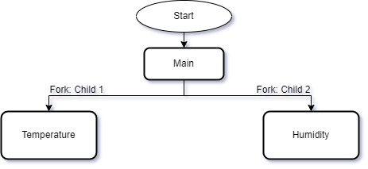

# IPCA-ASC-TP2

## Intro  
---  
Fork and Thread project to simulate the acquisition of sensor data and actuate depending on the average read.

The student's goal is to create a program capable of reading simultaneous temperature and humidity data from four sensors.  

There will be two processes created from the ```main``` process, one responsible for reading both temperature sensors, and one for the two humidity sensors.  

Sensor data writes should be stored in a 15 slot buffer and accessed by two concurrent threads, and read by a third concurrent thread per process. 



Each process will have 


## Resources

FIFO implementation: https://www.geeksforgeeks.org/named-pipe-fifo-example-c-program/

